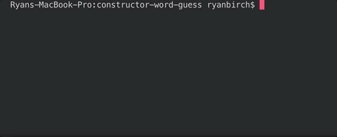

# Constructor Word Guess

## Overview
* This is a command line hangman game made with Node.js and JavaScript constructors. Guess the word by typing in letters, and the word will fill in as you guess the correct letters. 

 

## Packages Used: 
* npm inquirer

 

## Gameplay
